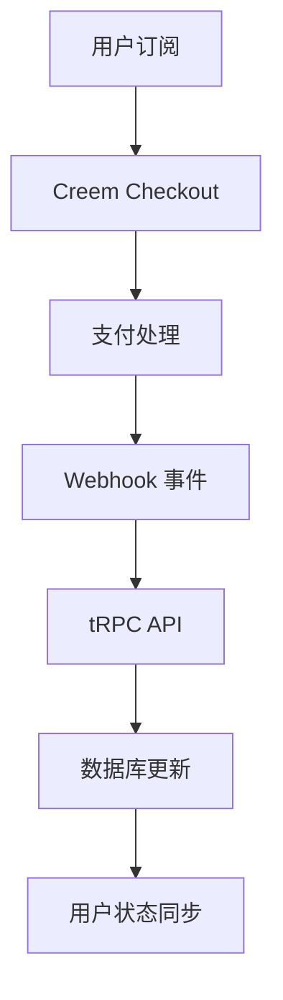

TokenFaucet 集成了 Creem 支付系统，提供安全的订阅管理和账单处理。

## 系统概述

### 核心特性

- **🔒 安全支付**: 基于 Creem 的 PCI 合规支付处理
- **📊 订阅管理**: 灵活的订阅计划和自动续费
- **💳 多种支付方式**: 支持信用卡、借记卡和数字钱包
- **🔄 Webhook 集成**: 实时事件处理和状态同步
- **⚡ 即时生效**: 订阅状态的实时更新

### 技术架构



## Creem 配置

### 环境变量设置

```bash
# Creem 配置
CREEM_API_KEY="creem_..."        # Creem API 密钥
CREEM_WEBHOOK_SECRET="whsec_..." # Webhook 签名密钥
```

### 产品 ID 配置

在数据库的 `membership_plans` 表中配置 Creem 产品 ID：

```sql
-- 更新 Lite 计划
UPDATE membership_plans
SET creem_monthly_product_id = 'prod_...',
    creem_yearly_product_id = 'prod_...'
WHERE name = 'Lite';

-- 更新 Pro 计划
UPDATE membership_plans
SET creem_monthly_product_id = 'prod_...',
    creem_yearly_product_id = 'prod_...'
WHERE name = 'Pro';
```

## 订阅计划

| 计划 | 月价 | 月积分 | 日积分 | 功能 |
|------|------|--------|--------|------|
| Free | $0 | 0 | 1,680 | 基础 TTS |
| Lite | $4.99 | 100,000 | 1,680 | MiniMax + MiMo |
| Pro | $16.89 | 300,000 | 1,680 | 全部功能 |

## Webhook 事件

| 事件 | 处理逻辑 |
|------|----------|
| `checkout.completed` | 创建支付记录 + 激活会员 |
| `subscription.active` | 仅同步日志 |
| `subscription.paid` | 续费 - 重新激活会员 |
| `subscription.canceled` | 设置 `autoRenew = false`（保留到期访问） |
| `subscription.scheduled_cancel` | 设置 `autoRenew = false` |
| `subscription.past_due` | 标记逾期状态 |
| `subscription.expired` | 取消会员 |
| `refund.created` | 更新支付记录 + 取消会员 |

## 升级计费

支持按比例计费（proration）：

- **升级**: 按剩余天数计算差价，立即收取
- **降级**: 在下一个计费周期生效

## 取消政策

- 用户取消订阅后，保留访问权限直到当前周期结束
- 设置 `autoRenew = false`，不自动续费
- 到期后会员状态自动变为 `expired`

## 安全特性

- **Webhook 签名验证**: 使用 `crypto.timingSafeEqual` 防止时序攻击
- **幂等性处理**: 使用 `creemCheckoutId` 防止重复处理
- **事务保护**: 会员激活使用数据库事务确保原子性
